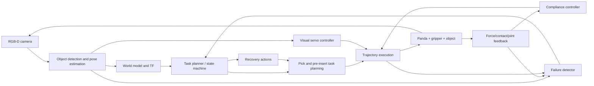

# Kế hoạch dự án Closed-Loop Vision-Guided Compliant Manipulation with Autonomous Failure Recovery

## 1. Định vị dự án

**Tên tiếng Anh:** Closed-Loop Vision-Guided Compliant Manipulation with Autonomous Failure Recovery.

**Tên tiếng Việt:** Hệ thống gắp-lắp ráp vòng kín dùng thị giác, điều khiển tiếp xúc mềm và tự phục hồi sau lỗi.

**Robot mục tiêu:** Franka Emika Panda 7-DoF với kẹp hai ngón, trước hết chạy hoàn toàn trong mô phỏng.

**Bài toán sản phẩm:** Robot thực hiện một quy trình **pick-and-insert assembly** thay vì chỉ gắp một khối hộp rồi đặt sang vị trí khác. Robot phải quan sát chi tiết và đồ gá, cập nhật sai lệch pose, gắp chi tiết, căn chỉnh vòng kín, chèn/lắp với tiếp xúc mềm, xác minh độ sâu lắp, phát hiện thao tác thất bại và tự chọn hành động phục hồi phù hợp.

Ví dụ lỗi cần xử lý:

- vật bị dịch chuyển sau khi đã lập kế hoạch;
- pose ước lượng sai hoặc bị che khuất;
- kẹp không trúng vật;
- vật trượt khỏi kẹp;
- lực tiếp xúc vượt ngưỡng;
- motion planner không tìm được quỹ đạo;
- robot chạm bề mặt hoặc miệng lỗ sớm hơn dự kiến;
- chi tiết lệch trục với lỗ/rãnh lắp;
- chi tiết bị kẹt trong quá trình chèn;
- hệ thống nhận nhầm tiếp xúc là đã lắp xong dù chưa đạt độ sâu yêu cầu.

**Thông điệp cho CV:** Dự án thể hiện khả năng tích hợp perception, motion planning, visual servoing, compliant control, contact-rich assembly, fault detection và task-level autonomy thành một hệ thống robot vòng kín có benchmark. Giá trị không nằm ở việc chạy lại demo MoveIt, mà ở khả năng hoàn thành lắp ráp khi có sai lệch hình học, giới hạn lực, kẹt và lỗi gắp thông qua cơ chế phản hồi và phục hồi có đo lường.

## 2. Quyết định kỹ thuật chính

### 2.1. Tài nguyên tính toán của MVP

MVP ưu tiên thuật toán robotics có thể chạy trên CPU và không phụ thuộc huấn luyện mô hình lớn. Các thành phần chính gồm:

- ROS 2 Jazzy;
- MoveIt 2 và MoveIt Task Constructor;
- Gazebo Harmonic hoặc simulator tương thích ROS 2;
- OpenCV, AprilTag/ArUco và `solvePnP`;
- visual servoing PBVS;
- điều khiển admittance/impedance;
- finite-state machine hoặc BehaviorTree.CPP;
- ghi log, benchmark và dashboard ngoại tuyến.

### 2.2. Stack đề xuất

- Host phát triển: Ubuntu 24.04, ưu tiên native Ubuntu; WSL2 có thể dùng cho giai đoạn đầu nếu Gazebo/RViz chạy ổn qua WSLg.
- Middleware: ROS 2 Jazzy.
- Planning: MoveIt 2 + OMPL; MoveIt Task Constructor cho chuỗi pick, transfer và insertion.
- Robot: Franka Panda.
- Simulator chính: Gazebo Harmonic để thuận tiện tích hợp `ros2_control`, camera và contact sensor.
- Simulator phụ tùy chọn: MuJoCo để kiểm tra contact/compliance độc lập.
- Perception MVP: RGB-D hoặc camera RGB + AprilTag gắn trên vật.
- Ngôn ngữ:
  - C++ cho control loop, MoveIt Task Constructor và node thời gian thực;
  - Python cho perception prototype, benchmark, metrics và visualization.

### 2.3. Nguyên tắc phạm vi

- Hoàn thành pick-and-place vòng hở và insertion hình học đơn giản trước.
- Thêm visual feedback trước khi thêm compliance.
- Chỉ đưa compliance vào đoạn tiếp cận/chèn cuối, không thay thế motion planner toàn cục.
- Thêm failure detection trước khi thêm recovery policy.
- Mỗi phase có exit criterion; không nhảy sang AI/VLA khi baseline chưa ổn.
- Không thay đồng thời perception, controller và recovery logic trong một thí nghiệm.

### 2.4. Bộ nhiệm vụ chuẩn của dự án

Để tránh kết quả chỉ là demo pick-and-place, dự án dùng hai mức nhiệm vụ:

1. **Task A - pick-and-place smoke test:** gắp vật và đặt vào vùng đích rộng. Task này chỉ dùng để xác nhận perception, planning, gripper và execution pipeline.
2. **Task B - pick-and-insert benchmark:** gắp một chi tiết dạng peg/keyed block và chèn vào hole/slot có clearance được kiểm soát. Đây là nhiệm vụ dùng cho kết quả chính, ablation và video portfolio.

MVP có thể bắt đầu với peg trụ-lỗ tròn để debug lực dọc trục. Benchmark cuối nên có thêm keyed/rectangular peg để tạo sai lệch góc, jam và yêu cầu căn chỉnh orientation rõ ràng.

## 3. Kiến trúc hệ thống



### 3.1. Phân tầng điều khiển

1. **Task layer:** quyết định trạng thái nhiệm vụ và recovery action.
2. **Planning layer:** tạo pre-grasp, grasp, transfer, pre-insert và retreat trajectories.
3. **Servo layer:** hiệu chỉnh pose của chi tiết so với đồ gá trong đoạn căn chỉnh cuối.
4. **Compliance layer:** giới hạn lực và điều khiển chuyển động mềm trong quá trình tiếp xúc/chèn.
5. **Low-level layer:** `ros2_control`/joint controller thực thi lệnh.

## 4. Luồng nhiệm vụ chuẩn

```text
IDLE
  -> OBSERVE
  -> ESTIMATE_OBJECT_POSE
  -> PLAN_PREGRASP
  -> MOVE_TO_PREGRASP
  -> VISUAL_ALIGN
  -> COMPLIANT_APPROACH
  -> CLOSE_GRIPPER
  -> VERIFY_GRASP
  -> LIFT
  -> VERIFY_HOLD
  -> OBSERVE_FIXTURE
  -> PLAN_PREINSERT
  -> MOVE_TO_PREINSERT
  -> VISUAL_ALIGN_INSERT
  -> COMPLIANT_INSERT
  -> VERIFY_INSERTION_DEPTH
  -> RELEASE
  -> RETREAT
  -> VERIFY_ASSEMBLY
  -> SUCCESS
```

Mọi bước có timeout, điều kiện thành công, failure code và recovery transition.

## 5. Mô hình và thuật toán cốt lõi

### 5.1. Ước lượng pose vật

MVP dùng AprilTag/ArUco hoặc các keypoint biết trước. Pose vật trong base frame:

\[
{}^{B}T_O = {}^{B}T_C\,{}^{C}T_O,
\]

trong đó:

- \({}^{B}T_C\) lấy từ TF/calibration;
- \({}^{C}T_O\) lấy từ tag detector hoặc PnP;
- mọi transform phải có timestamp và frame ID rõ ràng.

Pose estimator phải xuất thêm:

- confidence;
- tuổi của measurement;
- covariance hoặc proxy uncertainty;
- cờ occlusion/outlier.

### 5.2. Grasp pose

Với vật hình hộp/trụ biết trước, grasp pose được tạo từ pose vật và offset định trước:

\[
{}^{B}T_G = {}^{B}T_O\,{}^{O}T_G.
\]

Pre-grasp pose:

\[
p_{pre}=p_G-d_{pre}\,n_G,
\]

trong đó \(n_G\) là hướng tiếp cận của gripper.

Giai đoạn mở rộng mới thêm nhiều grasp candidates, scoring và deep grasp pose generation.

### 5.3. Motion planning

MoveIt Task Constructor chia nhiệm vụ thành các stage:

- CurrentState;
- OpenGripper;
- ConnectToPregrasp;
- GenerateGraspPose;
- ComputeIK;
- ApproachObject;
- CloseGripper;
- AttachObject;
- LiftObject;
- ObserveFixture;
- GeneratePreInsertPose;
- ConnectToPreInsert;
- AlignInsertionAxis;
- CompliantInsert;
- VerifyInsertionDepth;
- OpenGripper;
- DetachObject;
- Retreat.

Planner phải kiểm tra:

- collision với robot, bàn và vật cản;
- joint limits;
- velocity/acceleration limits;
- khả năng IK;
- execution timeout.

### 5.4. Position-based visual servoing

Trong đoạn tiếp cận cuối, pose error được biểu diễn trong \(SE(3)\):

\[
T_e = T_{current}^{-1}T_{desired},
\qquad
e = \operatorname{Log}(T_e)^\vee.
\]

Luật vận tốc Cartesian cơ bản:

\[
v_c=-\lambda W e,
\]

với giới hạn:

\[
\|v_{linear}\|\le v_{max},
\qquad
\|\omega\|\le \omega_{max}.
\]

Điều kiện dừng:

- translation error nhỏ hơn \(\epsilon_p\);
- orientation error nhỏ hơn \(\epsilon_R\);
- measurement còn mới và confidence đủ cao;
- không có collision/contact bất thường.

Nếu mất vật quá \(N\) frame, robot không tiếp tục đi mù mà chuyển sang recovery.

### 5.5. Admittance/impedance control

Mục tiêu là làm mềm đoạn cuối khi tiếp xúc. Một mô hình admittance Cartesian:

\[
M_d\ddot x_c+D_d\dot x_c+K_d(x_c-x_r)=F_{ext}-F_{ref}.
\]

Đầu ra \(x_c\) hoặc \(\dot x_c\) được giới hạn trước khi gửi xuống controller.

Nếu simulator/robot hỗ trợ torque control, có thể dùng impedance:

\[
\tau = J(q)^T\left[K_x e_x+D_x\dot e_x+F_{ff}\right]
+N(q)\tau_{null}+g(q).
\]

MVP nên bắt đầu bằng admittance hoặc velocity compliance vì dễ tích hợp và debug hơn. Phải có:

- giới hạn lực;
- giới hạn vận tốc/độ dịch chuyển compliance;
- watchdog;
- emergency retreat condition.

### 5.6. Điều khiển chèn và phát hiện kẹt

Pose mục tiêu được mô tả tương đối giữa chi tiết đang cầm và đồ gá. Sai lệch tịnh tiến được tách thành thành phần dọc trục chèn \(e_z\) và thành phần ngang \(e_{xy}\). Sai lệch quay quanh các trục ngang được ký hiệu \(e_R\).

Điều kiện cho phép bắt đầu chèn:

\[
\|e_{xy}\|\le \epsilon_{xy},
\qquad
\|e_R\|\le \epsilon_R.
\]

Trong quá trình chèn, robot điều khiển vận tốc dọc trục nhỏ và cho phép hiệu chỉnh ngang bị giới hạn. Độ sâu chèn được ước lượng từ pose tương đối:

\[
d_{ins}=n_{ins}^{T}(p_{start}-p_{current}).
\]

Một tình huống kẹt được xác định khi đồng thời có lực dọc trục lớn nhưng tiến độ chèn nhỏ trong một cửa sổ thời gian:

\[
|F_z|>F_{jam},
\qquad
\frac{\Delta d_{ins}}{\Delta t}<v_{progress,min}.
\]

Không dùng một mẫu lực đơn lẻ để kết luận kẹt. Detector phải dùng hysteresis/cửa sổ thời gian và phân biệt:

- tiếp xúc bình thường ở miệng lỗ;
- ma sát trong quá trình chèn;
- kẹt do lệch ngang/góc;
- chạm đáy thật;
- chạm đáy giả khi chưa đạt độ sâu yêu cầu.

Chèn thành công khi đồng thời thỏa mãn độ sâu, lực ổn định và pose tương đối:

\[
d_{ins}\ge d_{target}-\epsilon_d,
\quad
|F_z|\le F_{seat,max},
\quad
\|e_{xy}\|\le \epsilon_{seat}.
\]

### 5.7. Grasp verification

Không kết luận gắp thành công chỉ vì đã gửi lệnh đóng kẹp. Bộ xác minh kết hợp:

- gripper width nằm trong khoảng hợp lý;
- effort/contact vượt ngưỡng nhỏ nhưng không quá lớn;
- vật di chuyển cùng gripper sau khi lift;
- pose tương đối vật-gripper không thay đổi quá giới hạn;
- vật không còn ở vị trí cũ trên bàn.

Score tổng quát:

\[
s_g=w_1s_{width}+w_2s_{effort}+w_3s_{vision}+w_4s_{motion}.
\]

Gắp thành công khi \(s_g\ge s_{min}\) trong một cửa sổ thời gian, không chỉ tại một frame.

### 5.8. Failure detector

Failure codes tối thiểu:

| Code | Điều kiện |
|---|---|
| `OBJECT_LOST` | Không có pose hợp lệ quá timeout |
| `POSE_UNSTABLE` | Pose variance/outlier quá lớn |
| `PLAN_FAILED` | Không tìm được IK/path sau số lần cho phép |
| `EXECUTION_TIMEOUT` | Trajectory không kết thúc đúng hạn |
| `EARLY_CONTACT` | Contact xuất hiện trước vùng tiếp xúc dự kiến |
| `FORCE_LIMIT` | Lực/moment vượt ngưỡng |
| `GRASP_MISSED` | Kẹp đóng hết nhưng không giữ vật |
| `GRASP_SLIP` | Vật thay đổi pose tương đối sau khi lift |
| `INSERT_MISALIGNED` | Sai lệch ngang/góc vượt ngưỡng trước khi chèn |
| `JAM_DETECTED` | Lực tăng cao nhưng độ sâu chèn không tiến triển |
| `FALSE_SEATING` | Có tín hiệu tiếp xúc nhưng chưa đạt độ sâu yêu cầu |
| `INSERTION_INCOMPLETE` | Hết thời gian nhưng chi tiết chưa đạt pose lắp |
| `ASSEMBLY_UNSTABLE` | Chi tiết dịch chuyển/rơi sau khi nhả kẹp |

Detector giai đoạn đầu dùng rule-based logic để dễ giải thích và kiểm thử. Classifier học máy chỉ thêm khi đã có dataset lỗi đủ tốt.

### 5.9. Recovery policy

Recovery là task policy có điều kiện, không phải một lệnh retry vô hạn:

| Failure | Recovery |
|---|---|
| Object lost | Dừng, retreat, đổi viewpoint, quan sát lại |
| Pose unstable | Giữ vị trí, thu thập thêm frame, lọc pose |
| Plan failed | Sinh grasp candidate khác hoặc đổi pre-grasp |
| Early contact | Dừng compliance, retreat ngắn, cập nhật scene |
| Force limit | Nhả tải, retreat theo hướng an toàn |
| Grasp missed | Mở kẹp, retreat, estimate lại, thử offset khác |
| Grasp slip | Hạ vật an toàn nếu còn giữ được; sau đó regrasp |
| Insert misaligned | Dừng chèn, quay về pre-insert và chạy visual alignment lại |
| Jam detected | Rút ra một khoảng giới hạn, giảm tải, căn lại pose và chèn lại |
| False seating | Rút ngắn, kiểm tra pose/độ sâu và thử insertion offset khác |
| Insertion incomplete | Thực hiện bounded lateral search hoặc đổi insertion candidate |
| Assembly unstable | Giữ/thu hồi chi tiết nếu còn an toàn, sau đó re-observe đồ gá |

Mỗi nhiệm vụ có `max_retries`. Hết số lần cho phép phải chuyển sang `SAFE_ABORT`, không cố tiếp tục.

## 6. Kịch bản benchmark

### 6.1. Điều kiện danh định

- vật ở pose cố định;
- đồ gá/lỗ lắp ở pose cố định;
- tag nhìn rõ;
- không có nhiễu pose;
- không dịch chuyển vật;
- hệ số ma sát danh định;
- khe hở lắp nằm trong miền nominal.

### 6.2. Nhiễu thị giác

- Gaussian noise trên translation/orientation;
- frame drop;
- delay;
- occlusion ngắn;
- extrinsic calibration offset;
- false/outlier pose có kiểm soát.

### 6.3. Nhiễu vật thể và môi trường

- dịch vật sau khi robot đã lập kế hoạch;
- thay đổi kích thước/khối lượng vật trong miền cho phép;
- thay đổi ma sát gripper-vật;
- thay đổi nhỏ pose của đồ gá sau khi đã lập kế hoạch;
- thay đổi khe hở lắp và ma sát chi tiết-đồ gá trong miền benchmark;
- vật đặt lệch hoặc gần rìa vùng làm việc;
- thêm vật cản vào planning scene.

### 6.4. Nhiễu tiếp xúc

- bề mặt/miệng lỗ cao hoặc thấp hơn mô hình;
- contact sớm tại vành lỗ;
- vật trượt trong quá trình lift;
- gripper force không đủ;
- action delay;
- lệch trục chèn theo \(x,y,roll,pitch\);
- kẹt giả lập do tăng ma sát hoặc giảm clearance.

### 6.5. Fault injection đặc thù lắp ráp

Benchmark phải có các mức độ khó được định nghĩa trước:

- **Level 0:** pose chính xác, clearance lớn, không có nhiễu;
- **Level 1:** sai lệch ngang nhỏ, visual alignment đủ để sửa;
- **Level 2:** sai lệch góc và ma sát tăng, cần compliance;
- **Level 3:** phát sinh jam, cần withdraw-align-reinsert;
- **Level 4:** pose outlier hoặc vật trượt, cần quay lại bước quan sát/gắp.

Mỗi episode phải lưu pose sai lệch ban đầu, profile lực, độ sâu chèn, failure code, recovery action và kết quả cuối.

### 6.6. Ma trận ablation

| Cấu hình | Replan từ vision | Visual alignment | Compliant insertion | Jam/failure recovery |
|---|---:|---:|---:|---:|
| A. Open-loop assembly | No | No | No | No |
| B. Vision replanning | Yes | No | No | No |
| C. Closed-loop alignment | Yes | Yes | No | No |
| D. Vision + compliant insertion | Yes | Yes | Yes | No |
| E. Full autonomous recovery | Yes | Yes | Yes | Yes |

Đây là bảng so sánh chính của dự án. Mỗi thành phần mới phải chứng minh được giá trị bằng số liệu.

## 7. Metrics

### 7.1. Task metrics

- first-attempt success rate;
- final success rate sau recovery;
- recovery success rate;
- mean retries per successful task;
- task completion time;
- safe-abort rate;
- first-attempt insertion success rate;
- final assembly success rate;
- successful recovery rate theo từng jam/misalignment level.

### 7.2. Perception metrics

- translation/orientation pose error;
- pose update latency;
- lost-frame rate;
- outlier rejection rate;
- calibration sensitivity.

### 7.3. Control metrics

- final end-effector pose error;
- visual-servo convergence time;
- peak/RMS contact force;
- peak axial/lateral insertion force;
- insertion depth error;
- lateral/angular alignment error tại thời điểm bắt đầu chèn;
- insertion completion time;
- jam detection latency;
- force-limit violations;
- trajectory tracking error;
- controller deadline miss.

### 7.4. Planning và recovery metrics

- planning success rate và planning time;
- IK failure count;
- số trajectory bị hủy do pose update;
- confusion matrix của failure detector;
- recovery success theo từng failure type.

Mỗi benchmark phải dùng nhiều random seeds và xuất raw CSV/JSON. Video chỉ là minh họa, không thay cho số liệu.

## 8. Lộ trình triển khai

### Phase 0 - Audit môi trường và dựng repository

**Công việc**

- Audit Ubuntu/WSL, ROS 2, RAM, CPU và GUI acceleration.
- Chốt ROS 2 Jazzy + MoveIt 2 + Gazebo Harmonic version matrix.
- Tạo colcon workspace và repository structure.
- Tạo CI cho Python/C++ unit tests không cần simulator.
- Ghi `docs/environment_audit.md` và `docs/version_matrix.md`.

**Exit criterion:** MoveIt Panda demo, RViz và simulator smoke test chạy được; repo sạch và có lệnh tái lập.

### Phase 1 - Baseline pick-and-insert hình học

- Spawn Panda, bàn, chi tiết, đồ gá/lỗ lắp và camera.
- Thiết lập `ros2_control`, MoveIt config và planning scene.
- Chạy pick-and-place bằng pose ground truth.
- Chạy insertion đơn giản bằng pose ground truth và clearance lớn.
- Xây MoveIt Task Constructor pipeline từ pre-grasp đến pre-insert, insert, release và retreat.
- Log planning/execution result.

**Exit criterion:** ít nhất 95% thành công trong điều kiện danh định với pose ground truth, nhiều initial poses hợp lệ và không có contact-force violation.

### Phase 2 - Perception pipeline

- Camera calibration và TF tree.
- AprilTag/ArUco detection.
- Pose filtering, confidence và stale-data checks.
- Publish pose của chi tiết và đồ gá cùng collision objects vào planning scene.
- So sánh estimate với simulator ground truth chỉ để đánh giá.

**Exit criterion:** pose error và latency nằm trong ngưỡng đã định; robot gắp và đi tới pre-insert bằng pose vision thay vì ground truth.

### Phase 3 - Closed-loop visual servoing

- Thêm pre-grasp và visual-servo phase.
- Implement PBVS với giới hạn vận tốc.
- Xử lý frame drop, outlier và object lost.
- Thử nghiệm chi tiết hoặc đồ gá bị dịch chuyển sau planning.
- Căn chỉnh pose tương đối chi tiết-đồ gá trước khi chèn.

**Exit criterion:** cấu hình C vượt B rõ ràng về insertion success khi pose bị thay đổi và không tăng collision/timeout.

### Phase 4 - Compliant insertion

- Thêm contact/wrench sensor mô phỏng.
- Implement admittance controller.
- Thêm force limits, watchdog và retreat.
- Thêm ước lượng insertion depth và tiến độ chèn.
- Benchmark sai lệch trục, clearance, ma sát và early contact tại miệng lỗ.

**Exit criterion:** cấu hình D giảm peak force/force violations và tăng insertion success so với C trong các ca có sai lệch nhỏ.

### Phase 5 - Failure detection

- Chuẩn hóa failure codes.
- Implement detector cho object lost, plan failed, force limit, missed grasp, slip, misalignment, jam và incomplete insertion.
- Viết fault-injection tests cho từng lỗi.
- Log evidence dẫn đến quyết định lỗi.

**Exit criterion:** detector có confusion matrix và không dựa vào simulator ground-truth flag trong chế độ deployable.

### Phase 6 - Autonomous recovery

- Implement FSM trước; chuyển sang BehaviorTree.CPP nếu logic phức tạp.
- Thêm retry budget, cooldown và safe abort.
- Implement re-observe, replan, grasp-offset change, withdraw-align-reinsert và bounded lateral search.
- Benchmark từng failure type.

**Exit criterion:** cấu hình E tăng final success rate so với D và không có retry vô hạn/hành vi nguy hiểm.

### Phase 7 - Hệ thống đánh giá và UI

- Tạo experiment runner theo YAML.
- Xuất CSV/JSON và hình tự động.
- Tạo dashboard nhỏ hiển thị camera, state, pose, force, failure code và recovery step.
- Record rosbag cho episode lỗi.

**Exit criterion:** một lệnh chạy toàn bộ benchmark và tạo report có thể tái lập.

### Phase 8 - Perception nâng cao, không bắt buộc

- Thay tag bằng detector pretrained nhẹ.
- Dùng depth/point cloud để ước lượng pose.
- Sinh nhiều grasp candidates và scoring.

**Exit criterion:** tag-free perception phải vượt benchmark riêng trước khi thay pipeline MVP.

### Phase 9 - Khả năng chuyển sang nền tảng khác, không bắt buộc

- Giữ hardware abstraction và ROS interfaces độc lập với Panda simulation.
- Tách calibration, joint limits, controller gains và safety parameters khỏi logic nhiệm vụ.
- Ghi rõ checklist cần có nếu sau này chuyển sang arm khác hoặc môi trường thực.

Phase này không phải điều kiện hoàn thành phần lõi của dự án mô phỏng.

## 9. Cấu trúc repository đề xuất

```text
closed_loop_compliant_manipulation/
├── README.md
├── LICENSE
├── THIRD_PARTY.md
├── .github/workflows/
├── docker/
├── configs/
│   ├── experiments/
│   ├── perception/
│   ├── servo/
│   ├── compliance/
│   └── recovery/
├── ros2_ws/src/
│   ├── manipulation_bringup/
│   ├── manipulation_description/
│   ├── manipulation_moveit_config/
│   ├── object_perception/
│   ├── visual_servo_controller/
│   ├── compliance_controller/
│   ├── grasp_verification/
│   ├── failure_detection/
│   ├── recovery_manager/
│   ├── manipulation_msgs/
│   └── experiment_runner/
├── scripts/
├── tests/
├── experiments/
│   ├── manifests/
│   ├── raw/
│   └── summaries/
└── docs/
    ├── architecture.md
    ├── environment_audit.md
    ├── version_matrix.md
    ├── failure_taxonomy.md
    ├── experiment_protocol.md
    └── hardware_safety.md
```

## 10. ROS interfaces tối thiểu

### Topics

- `/camera/color/image_raw`
- `/camera/depth/image_raw`
- `/object_pose`
- `/object_pose_debug`
- `/joint_states`
- `/wrench`
- `/gripper_state`
- `/manipulation/state`
- `/manipulation/failure_event`
- `/manipulation/metrics`

### Actions

- `/manipulation/execute_pick`
- `/manipulation/execute_place`
- `/visual_servo/align`
- `/compliance/approach`
- `/recovery/execute`

### Services

- `/perception/reobserve`
- `/manipulation/verify_grasp`
- `/manipulation/reset_scene`
- `/experiment/inject_fault`

Message phải chứa timestamp, frame, confidence, status code và diagnostic text. Không truyền business logic bằng chuỗi tùy ý.

## 11. Kiểm thử

### Unit tests

- SE(3)/TF conversion;
- pose filter và outlier rejection;
- visual-servo error và saturation;
- compliance integration và limits;
- grasp score;
- failure transition table;
- retry budget.

### Integration tests

- planner với planning scene;
- camera pose đến object TF;
- object moved sau planning;
- force-limit triggers retreat;
- missed grasp triggers re-observe;
- slip triggers safe lowering/regrasp;
- exhausted retries triggers safe abort.

### Regression tests

- fixed seeds;
- expected metric ranges;
- no new collision/force violation;
- benchmark report diff trong CI nếu phù hợp.

## 12. Tài liệu cần đọc

### Đọc ngay

1. [MoveIt 2 Getting Started](https://moveit.picknik.ai/main/doc/tutorials/getting_started/getting_started.html)
2. [MoveIt motion planning concepts](https://moveit.picknik.ai/main/doc/concepts/motion_planning.html)
3. [Pick and Place with MoveIt Task Constructor](https://moveit.picknik.ai/main/doc/tutorials/pick_and_place_with_moveit_task_constructor/pick_and_place_with_moveit_task_constructor.html)

### Đọc khi làm visual servoing

4. François Chaumette và Seth Hutchinson, **Visual Servo Control, Part I: Basic Approaches**:
   <https://web.mit.edu/amcp/OldFiles/drg/Chaumette_Part_I.pdf>

Tập trung vào PBVS, IBVS, interaction matrix, convergence và singularities.

### Đọc khi làm compliance

5. Neville Hogan, **Impedance Control: An Approach to Manipulation, Part I - Theory**:
   <https://newmanlab.mit.edu/wp-content/uploads/2017/09/1985-impedance-control-an-approach-to-manipulation-part-I-theory.pdf>

Tập trung vào quan hệ động lực học robot-môi trường và phân biệt impedance/admittance.

### Đọc khi logic recovery phức tạp

6. [BehaviorTree.CPP integration with ROS 2](https://www.behaviortree.dev/docs/ros2_integration/)

FSM đủ cho MVP. Chỉ chuyển sang behavior tree khi số nhánh recovery làm FSM khó kiểm thử.

## 13. Rủi ro và cách giảm thiểu

| Rủi ro | Hậu quả | Giảm thiểu |
|---|---|---|
| Gazebo/RViz chạy kém trên WSL | GUI chậm hoặc lỗi | Native Ubuntu hoặc giảm rendering; test sớm |
| Quá phụ thuộc ground truth | Demo không deploy được | Ground truth chỉ dùng metric, không đưa vào controller |
| Visual servo rung | Hành vi không an toàn | Filtering, gain scheduling, velocity bounds, stale checks |
| Contact model không thực tế | Compliance đẹp giả tạo | Sim-to-sim hoặc sensitivity tests |
| Failure detector dùng ngưỡng tùy tiện | False trigger | Validation set và confusion matrix |
| Retry vô hạn | Hành vi nguy hiểm | Retry budget và safe abort |
| Scope phình sang VLA | Không hoàn thành core | Tag-based MVP trước |
| Chỉ có video | Khó chứng minh đóng góp | Ablation A-E và raw metrics |

## 14. Definition of Done

Dự án được coi là hoàn thành khi:

- một lệnh có thể khởi chạy simulation và hệ thống;
- object pose dùng bởi controller đến từ perception, không phải ground truth;
- robot có visual correction trong đoạn tiếp cận cuối;
- robot hoàn thành pick-and-insert dựa trên pose của chi tiết và đồ gá từ perception;
- compliance giảm lực tiếp xúc và tăng insertion success trong benchmark lệch trục;
- hệ thống phân biệt được tiếp xúc bình thường, jam và false seating;
- hệ thống phát hiện ít nhất sáu loại lỗi, gồm lỗi gắp và lỗi insertion;
- hệ thống có ít nhất ba recovery action khác nhau;
- có recovery `withdraw-align-reinsert` với retry budget;
- có so sánh A-E bằng nhiều seeds;
- không có retry vô hạn và có safe abort;
- raw metrics, config và video được liên kết với Git commit;
- README tách rõ upstream và phần tự phát triển;
- kết luận giới hạn đúng trong phạm vi mô phỏng đã kiểm chứng.

## 15. Kết quả portfolio cần có

- Video 60-90 giây: open-loop insertion thất bại, visual alignment, compliant insertion, jam detection và withdraw-align-reinsert recovery.
- Hình kiến trúc hệ thống.
- Biểu đồ insertion/assembly success rate A-E.
- Biểu đồ peak axial/lateral force C-D-E.
- Biểu đồ final success trước/sau recovery.
- Biểu đồ recovery success theo mức misalignment/jam.
- Failure taxonomy và recovery transition diagram.
- README có lệnh tái lập.
- Báo cáo kỹ thuật 6-10 trang.

### CV bullet mẫu

> Built a closed-loop pick-and-insert assembly system in ROS 2 and MoveIt 2 combining vision-based relative pose estimation, visual alignment, compliant insertion, grasp/assembly verification, jam detection, and bounded autonomous recovery; evaluated the system through fault injection and ablations from open-loop execution to withdraw-align-reinsert recovery.

Chỉ thêm số phần trăm cải thiện sau khi có kết quả thực.

## 16. CV readiness gate

Dự án chỉ được đưa vào CV như một project hoàn chỉnh khi đạt toàn bộ nhóm điều kiện bắt buộc dưới đây. Phase 8 về learned perception và Phase 9 về phần cứng không phải điều kiện để qua gate.

### 16.1. Hệ thống phải vượt mức demo upstream

- Task A pick-and-place chỉ là smoke test; kết quả chính phải đến từ Task B pick-and-insert.
- Pipeline phải chạy vòng kín từ camera -> pose estimate -> TF/planning scene -> planning/servo/compliance -> verification -> recovery.
- Controller deployable không được đọc pose, contact state, failure flag hoặc insertion success từ ground truth của simulator. Ground truth chỉ được dùng trong evaluator để tính sai số và gán nhãn benchmark.
- Phần tự phát triển phải được tách rõ khỏi MoveIt/Gazebo demo và thư viện upstream trong README và `THIRD_PARTY.md`.
- Một lệnh hoặc một launch entry point phải khởi động được scene, robot, perception, controller và task manager từ một checkout sạch đã cài dependency.

### 16.2. Năng lực kỹ thuật phải được chứng minh riêng

- **Perception:** pose của chi tiết và đồ gá đến từ ảnh camera; có timestamp, frame ID, confidence, stale-data check, outlier rejection và báo cáo translation/orientation error.
- **Closed-loop vision:** khi chi tiết hoặc đồ gá bị dịch chuyển sau planning, robot phải hủy/cập nhật hành động cũ và căn chỉnh lại; không tiếp tục chuyển động mù khi measurement mất hoặc hết hạn.
- **Compliance:** có giới hạn lực, vận tốc và displacement; báo cáo peak/RMS axial-lateral force, force-limit violations và insertion depth.
- **Failure detection:** phát hiện được tối thiểu sáu nhóm lỗi, trong đó bắt buộc có `OBJECT_LOST`, `PLAN_FAILED`, `FORCE_LIMIT`, `GRASP_MISSED` hoặc `GRASP_SLIP`, `INSERTION_JAM` và `INCOMPLETE_INSERTION`/false seating.
- **Recovery:** có tối thiểu ba recovery action khác nhau; bắt buộc có re-observe/replan, compliant retreat và `withdraw-align-reinsert`.
- **Safety:** mọi recovery có timeout, retry budget, force/motion bounds và transition tới `SAFE_ABORT`; không có vòng lặp retry vô hạn.

### 16.3. Benchmark tối thiểu cho portfolio

- Chạy đủ A/B/C/D/E trên cùng tập initial states, fault schedule và disturbance distribution.
- Mỗi cấu hình có tối thiểu 5 evaluation seeds và tổng ít nhất 100 episode cho tập kết quả chốt; run debug không được trộn vào số liệu cuối.
- Có ít nhất ba mức độ khó cho các nhóm chính: pose/misalignment, contact-friction/clearance và observation drop/delay.
- Báo cáo first-attempt success, final success after recovery, safe-abort rate, task time, peak force, insertion depth error, jam-detection latency và recovery success theo failure type.
- Báo cáo số mẫu, mean và độ phân tán hoặc confidence interval; không chỉ chọn video hoặc seed tốt nhất.
- C phải cải thiện khả năng hoàn thành khi pose thay đổi so với B; D phải giảm peak force/force violations so với C mà không phá nominal success; E phải tăng final success so với D trong fault benchmark. Nếu dữ liệu không ủng hộ giả thuyết nào, phải báo cáo trung thực và không tạo claim cải thiện tương ứng trên CV.

### 16.4. Chất lượng phần mềm và khả năng tái lập

- Unit test bao phủ SE(3)/TF math, pose filtering, servo saturation, compliance bounds, failure transitions và retry budget.
- Integration test bao phủ ít nhất object moved after planning, lost vision, early contact/force limit, missed grasp, jam và exhausted retries.
- CI phải build và chạy được các test không cần GUI; benchmark simulator có script riêng và ghi rõ yêu cầu host.
- Mỗi experiment phải lưu config, seed, Git commit, version matrix, raw CSV/JSON và đường dẫn artifact trong manifest.
- README phải có quick start, architecture, scenario matrix, bảng kết quả, limitation và lệnh tái lập; checkpoint, rosbag và video lớn không commit trực tiếp vào Git.
- Video portfolio phải có cả failure và recovery, đồng thời hiển thị đủ camera/state/force hoặc overlay để người xem phân biệt phản hồi vòng kín với trajectory dựng sẵn.

### 16.5. Quy tắc ghi vào CV

- Nếu chỉ chạy mô phỏng, phải ghi rõ `in simulation` hoặc `for a simulated Franka Panda`; không ngụ ý đã deploy trên robot thật.
- Nếu dùng AprilTag/ArUco, mô tả là `fiducial-based pose estimation` hoặc `classical vision`, không gọi là deep-learning perception.
- Chỉ ghi con số cải thiện đã xuất hiện trong summary tái lập được và có manifest trỏ tới raw data.
- Không cần GPU hoặc learned perception để qua CV readiness gate. Một hệ thống hình học vòng kín có benchmark, compliance và recovery đầy đủ có giá trị hơn một detector học sâu chưa được tích hợp và đánh giá end-to-end.

### 16.6. Bộ artifact bắt buộc trước khi chốt CV bullet

- một video 60-90 giây có open-loop failure, closed-loop correction, compliant insertion, jam detection và recovery;
- một sơ đồ kiến trúc và một state/recovery diagram;
- một bảng A-E và ít nhất ba biểu đồ: task success, peak force, final success before/after recovery;
- raw data và script tạo lại toàn bộ bảng/biểu đồ;
- báo cáo kỹ thuật 6-10 trang nêu method, experiment, ablation, failure cases và limitations;
- một release/tag hoặc Git commit bất biến tương ứng với kết quả được ghi trên CV.

**Gate đạt:** chỉ khi các mục 16.1-16.6 hoàn tất và các claim trong CV truy vết được tới artifact. Nếu mới hoàn thành một phần, chỉ mô tả đúng phần đã chạy và không dùng các động từ như `validated`, `improved` hoặc `robust` khi chưa có benchmark hỗ trợ.

## 17. Prompt khởi động cho AI coding agent

```text
Bạn đang làm việc trên dự án "Closed-Loop Vision-Guided Compliant Manipulation with Autonomous Failure Recovery".

Sản phẩm trung tâm là pick-and-insert assembly: robot gắp chi tiết, quan sát đồ gá, căn chỉnh pose tương đối, chèn bằng compliance, phát hiện jam/false seating và tự withdraw-align-reinsert. Không được thu hẹp dự án thành demo pick-and-place thông thường.

Trước khi làm gì:
1. Đọc toàn bộ CLOSED_LOOP_VISION_COMPLIANT_MANIPULATION_PLAN.md.
2. Đọc README, AGENTS.md nếu có và kiểm tra git status. Không revert thay đổi của người dùng.
3. Chỉ thực hiện Phase 0. Chỉ sang Phase 1 sau khi exit criterion Phase 0 đạt.
4. Xem mục 16 là gate bắt buộc cho portfolio/CV; không tuyên bố dự án hoặc CV bullet hoàn tất khi chưa có artifact và benchmark tương ứng.

Mục tiêu lần làm việc đầu:
- Audit OS/WSL, CPU, RAM, ROS 2, Gazebo/RViz GUI và dung lượng đĩa.
- Chốt version matrix tương thích cho Ubuntu 24.04, ROS 2 Jazzy, MoveIt 2 và Gazebo Harmonic từ tài liệu chính thức.
- Không cài thêm simulator hoặc dependency ngoài version matrix đã chốt.
- Tạo repository/colcon scaffold theo kế hoạch.
- Tạo docs/environment_audit.md, docs/version_matrix.md và THIRD_PARTY.md.
- Tạo .gitignore cho build/install/log, rosbag, dataset và generated artifacts.
- Cài hoặc xác minh ROS 2/MoveIt theo từng cụm nhỏ; sau mỗi cụm chạy smoke test.
- Chạy MoveIt Panda demo trong RViz.
- Chạy simulator smoke test và xác nhận TF/joint_states/ros2_control cơ bản.
- Thêm script hoặc tài liệu lệnh tái lập.

Không được làm trong lần đầu:
- Không triển khai learned perception hoặc VLA trước khi baseline hình học chạy ổn.
- Không implement visual servo/compliance/recovery trước khi Panda baseline chạy.
- Không copy demo upstream rồi nhận là code riêng.
- Không commit build outputs, bags, videos hoặc model artifacts.
- Không báo PASS nếu chỉ build được nhưng chưa chạy smoke test.

Nếu WSL2 không chạy Gazebo/RViz ổn:
- Ghi rõ lỗi và bằng chứng.
- Đề xuất native Ubuntu hoặc một simulator CPU nhẹ hơn.
- Không dành nhiều giờ vá GUI nếu host không phù hợp.

Cuối cùng báo cáo:
1. File đã thay đổi.
2. Lệnh đã chạy và PASS/FAIL.
3. Version đã pin.
4. Phase gate hiện tại.
5. Blocker và bước tiếp theo ngắn nhất.

Ưu tiên hệ thống nhỏ, chạy thật, tái lập được. Không mở rộng kiến trúc trước khi baseline Panda + MoveIt + simulator được xác nhận.
```
